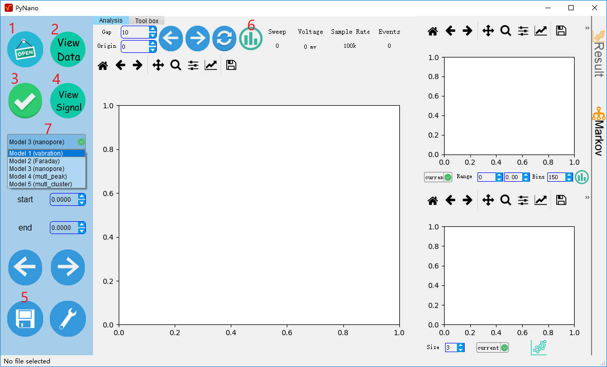
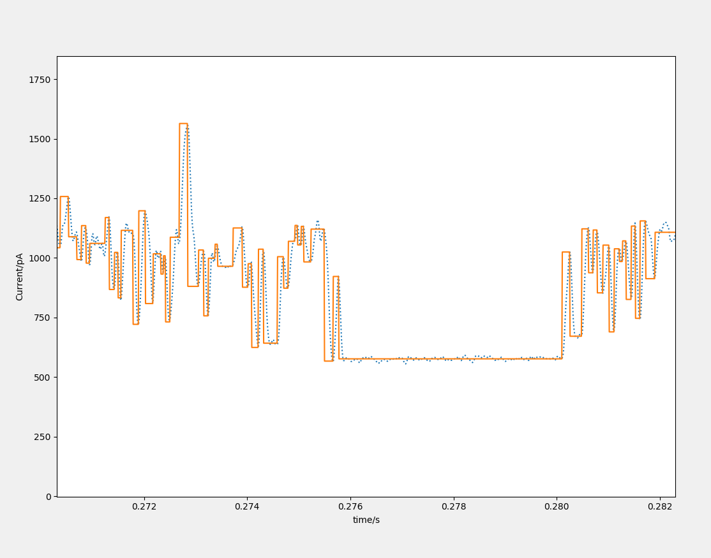
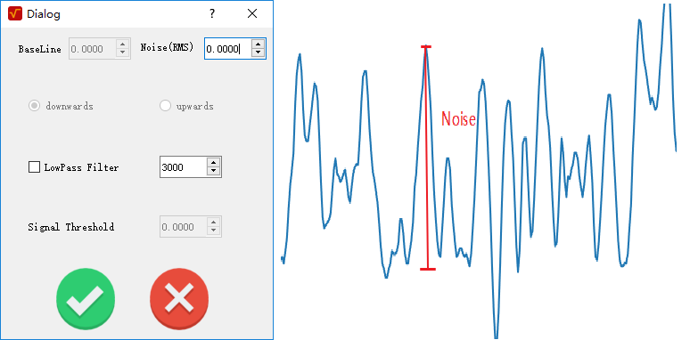
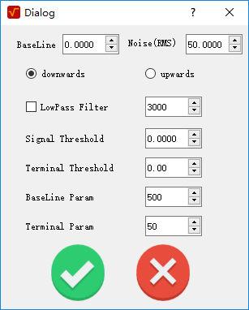
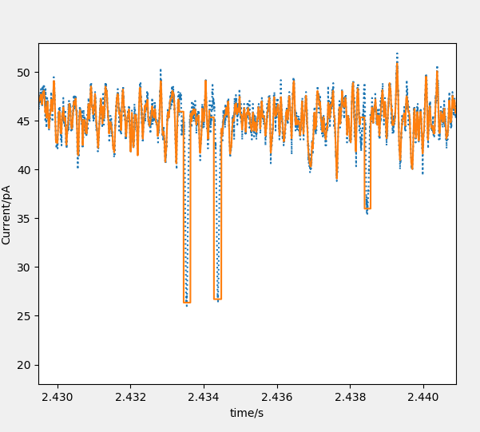
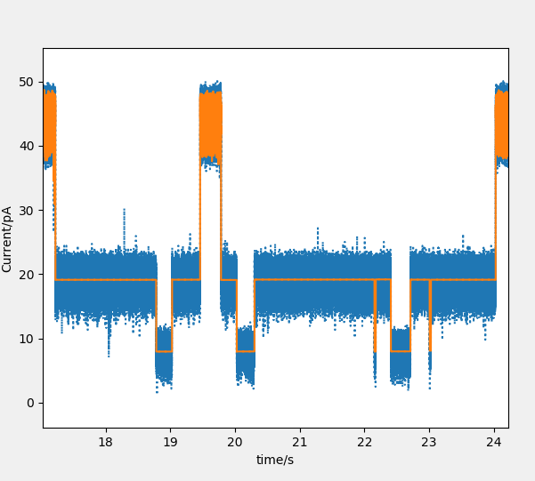

# PyNano 

PyNano  is a nanopore data analysis interface, which can be used to analysis the data of bionanopore, solid-state nanopore and  similar kinds of  pulse signal.	

In this project, the UI is using the PyQt5. The data processing is using the [numpy](http://www.numpy.org/), [scipy](https://www.scipy.org/) and [sklearn](http://scikit-learn.org/stable/). The data visualization is using [matplotlib](https://matplotlib.org/).

## Installation 

Note: no .exe build will support any more.

#### For Windows:

1. Install the python >3.5 and add the python into the environment variable.  [Anaconda](https://www.anaconda.com/download/) is  recommended. 

Install the [git bash for windows](https://gitforwindows.org/).

2. download the source file. Direct the .zip file or using the git clone. Git for windows is needed.

   ```sh
   git clone https://github.com/decacent/PyNano.git
   ```

3. Install the requirement. 

    If you use python package of anaconda. Most of package have already included into it. Just need run the following command.

   ```shell
   pip install nptdms
   pip install PyWavelets
   ```

   If else, you need install all the package that required.

   ```
   cd PyNano
   pip install -r requirements.txt
   ```

4. Run. Double click the file pynano.sh or 

   ```sh
   python pynano.py
   ```

#### For Linux and Mac:

Just build the python development environment and run pynano.py 

If you can't do it. Please throw your mac laptop into trash and go back the fuck windows.

## PyNano interface



#### **Button function**

**1**: Open the file，this software only support the file of .abf > 2.0 acquired from axon instrument. The api 	support the array data of numpy.

**2**: preview the original data.

**3**: start the analysis

**4**: preview the fitting result.

**5**: save the analysis result, supporting the .mat and .csv format.

**6**: Plot the histogram of original data.

**7**: select the analysis method.

All the data view window is using the matplotlib. So the button function is the same with it.

#### Analysis method

**Mode 1：vabrication.**  This method is used for long time, mult-stage signal.

The  parameter  noise(RMS) is need:

**Mode 2: Faraday.** This method is only  suited to  the signal result from Faraday current.

The explain of the parameter please see the annotation of the function *collision_analy* in `pynano/analysis/scat_analy.py`

**Mode 3: nanopore.** This method is used to fit the single-peak signal of nanopore. 

**Mode 4: mutl_peak.**Fit the mutl-peak signal of nanopore.



#### API

**File IO**

read the .abf > 2.0 file.

```python
from pynano.analysis import axonio
f = axonio.Abf_io('file_name')
header =f.read_header()
data = f,read_abf()
```

**Analysis**

For example: mode 3 

```python
from pynano.analysis.scat_analy import signal_extract2
help(signal_extract2)
result, fit_data = signal_extract2(init_time, data, peak_th, base, th=100, sam=100000, filter=3000, is_filter=False, is_up=False)
```

